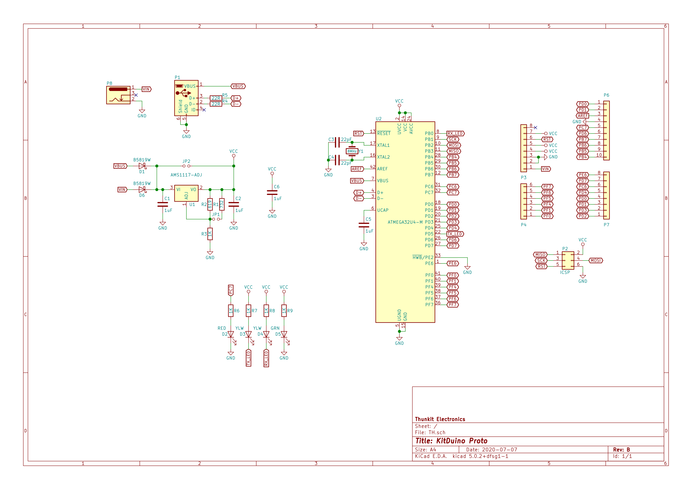

# About #
Thunkit Electronics sells electronic kits and rocket altimeters, available at [thunkitelectronics.com](https://thunkitelectronics.com) and [Tindie](https://www.tindie.com/stores/cmccaskey). All designs are open source with schematics, board layouts, code, and BOMs available. The Creative Commons Attribution-NonCommercial-ShareAlike 4.0 International License is used and can be read [here]( https://creativecommons.org/licenses/by-nc-sa/4.0/legalcode).

## Description ###
  
The KitDuino Proto is a 32u4 Arduino compatible with built in prototyping area. The board supports 3 voltage modes selectable by jumpers: 3.3V regulated, 5V regulated, and Vin direct with no regulation.

## Why KitDuino Proto? ## 
The KitDuino Proto is a one of a kind Arduino compatible board. It uses the Atmel ATmega32u4 and can be programmed by the Arduino IDE using the Thunkit Arduino Core available [here](https://github.com/cmccaskey/Thunkit-Arduino-Core/tree/master).The KitDuino Proto has a small prototyping area making it a great addition to your next project.

## Technical Specifications ##
The KitDuino Proto runs at 8MHz to allow for 3.3V and 5V operation. The KitDuino Proto supports 3 voltage modes. By default, the board will run at 3.3V. By installing the jumper in the '5V SEL' position, the board will run at 5V. When powered over USB, due to losses in the regulator circuit, the board will run at approximately 3.8V. If an external voltage sorce of 7V or higher is used, a stable 5V rail will be generated by the regulator. For projects that are always powered off of USB and never see a Vin of more than 5V, the 'Vin SEL' jumper can be installed. This jumper directly connects the USB voltage (after schottky diode) to VCC. Beware! Installing the 'Vin SEL' jumper and connecting a Vin of more than 5V can cause permanent damage to your board!

## BOM ##
KiCad interactive BOM available at [thunkitelectronics.com](https://thunkitelectronics.com).

## Schematic ##
  
